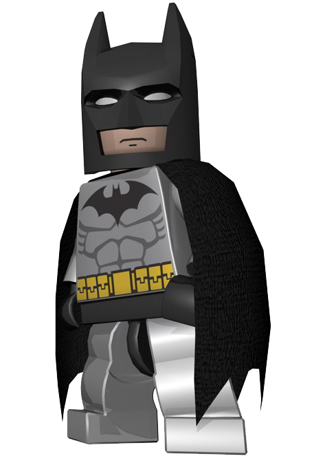

# Batman's Progress Reports

I am Batman. My main focus within this project is to:

- fight crimes and
- hunt down evil villains

---

## 1939-03-30

- Today I started to work one of my most important missions: Fighting Crime! This seems to be an never ending story... (82 years so far)
- Appeared in Detective Comics - **DAMNIT - now EVERYONE knows I am Bruce Wayne!!** 

---

... (*lots of entries*) ...

---

## 2021-02-15

- Learned to build my own BATARANG by following this tutorial: [How to Make a DIY Batarang : 5 Steps (with Pictures) - Instructables](https://www.instructables.com/DIY-BATARANG/) (~3 hrs)
  - lots of interesting DIY projects there, need to tryout some more...
- Learned about myself: [Batman - Wikipedia](https://en.wikipedia.org/wiki/Batman) (~30 min of reading)

## 2021-02-16

- Today I aided teaching students "Mastering Github" (1hr 35min)

## 2023-10-16

- Once again, I assisted to teach students how to write progress reports (15 min)
- I get nervous, need to hunt down another villain soon... (5min)

