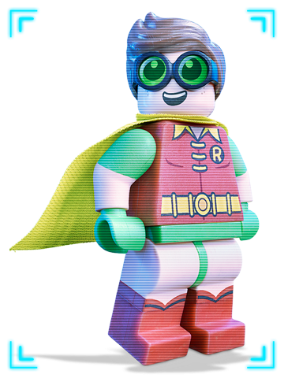

# Robin's Progress Reports

I am Robin. My main focus within this project is to:

- play Batman's sidekick
- help Batman to fight crime

---

## 1940-04-01

- Today I started to work with my hero: Batman - He adopted me (for whatever reason - ok the main reason was to increase comic book sales)  (81 years so far)
- Appeared in Detective Comics - **DAMNIT - now EVERYONE knows I am Dick Grayson - NO! - Jason Todd - NO! - Tim Drake - NO! - Stephanie Brown - NO! - Damian Wayne!?! ** 
  - **Who am I? Why am I?** 

---

... (*lots of entries*) ...

---

## 2021-02-15

- Helped Bruce to build a BATARANG by following this tutorial: [How to Make a DIY Batarang : 5 Steps (with Pictures) - Instructables](https://www.instructables.com/DIY-BATARANG/) (~3 hrs)
  - lots of interesting DIY projects there, need to tryout some more...
- Learned about myself: [Robin (character) - Wikipedia](https://en.wikipedia.org/wiki/Robin_(character))  - still don't know who I am...(~30 min of reading)

## 2021-02-16

- Today I aid with teaching students "Mastering Github" (1hr 35min)
- Bruce is getting nervous, I think he wants to hunt down another villain soon... (5min)

